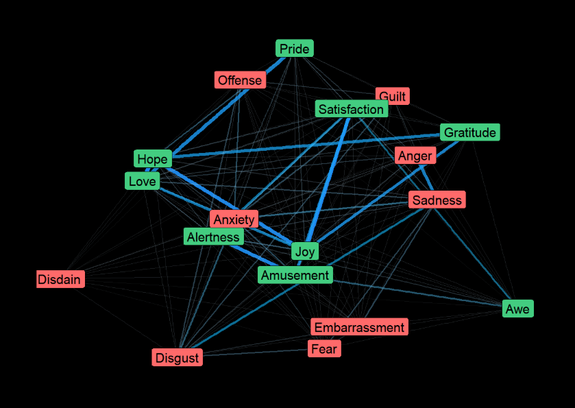
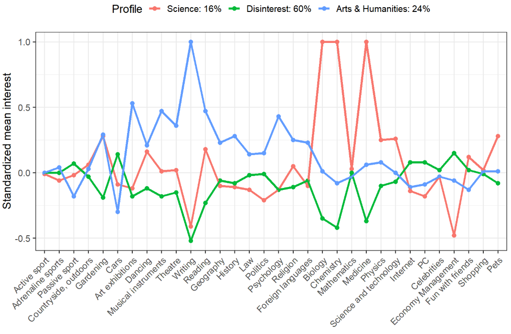

## R-Bloggers

### [How to create professional reports from R scripts](https://www.r-bloggers.com/how-to-create-professional-reports-from-r-scripts-with-custom-styles/)  
* Introduce practical tips about how we can easily create professional reports directly from R scripts.
* Provide useful tips on advanced options for styling, using themes and producing light-weight HTML reports directly from R scripts.  

    + Creating reports directly from R scripts
    + Using `knitr::spin` directly
    + Using `rmarkdown::render`  
    
 
    
### [Network Analysis of Emotions](https://www.r-bloggers.com/network-analysis-of-emotions/)  

* Create a visual network of emotions  

    + Emotion Dynamics tells us that different emotions are highly interconnected, such that one emotion morphs into another and so on.
* What is a network?  

    + a network is a complex set of interrelations between variables
        + `nodes` : variables
        + `edges` : the relationship between the variables
    + Using `ggraph`
    + Using `networkD3` to create interactive plot  
  
    
 ### [DALEX has a new skin!](https://www.r-bloggers.com/dalex-has-a-new-skin-learn-how-it-was-designed-at-gdansk2019-satrdays/)

 * DALEX is an R package for visual explanation, exploration, diagnostic and debugging of predictive ML models  
 
    + bunch of visual explainers for different aspects of predictive models
    + useful during model development, fine tuning, model diagnostic or model explanations

 
 

### [Quick Example of Latent Profile Analysis in R](https://www.r-bloggers.com/quick-example-of-latent-profile-analysis-in-r/)

* LPA (Latent Profile Analysis)
    + identifies clusters of individuals based on responses to a series of continuous variables
    + assumes that there are unobserved latent profiles that generate patterns of responses on indicator items
    + chooses the best cluster size using methods such as BIC
   
